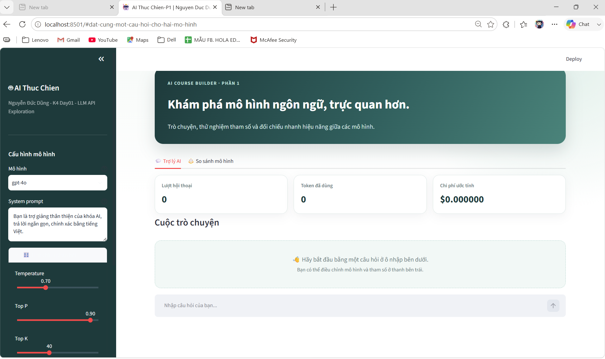

# 🤖 AICB-P1 · LLM API Playground

Giao diện Streamlit để thử nghiệm mô hình ngôn ngữ lớn (LLM): trò chuyện với trợ lý AI, điều chỉnh tham số sinh văn bản và so sánh phản hồi giữa hai model.

> Dự án được xây dựng trong buổi thực hành **K4 – Ngày 1: LLM API Exploration**.



## ✨ Những phần đã thực hiện

- Giao diện Streamlit với bố cục hiện đại, tông màu navy–teal dịu mắt.
- Thanh cấu hình riêng để chọn model, nhập system prompt và điều chỉnh `temperature`, `top_p`, `top_k`, `max_tokens`.
- Chatbot lưu lịch sử trò chuyện trong phiên làm việc.
- Thống kê số lượt chat, token đã dùng và chi phí ước tính.
- So sánh phản hồi, thời gian chạy và chi phí giữa model chính và model mini.
- Trạng thái chờ và thông báo lỗi rõ ràng khi chưa có dữ liệu hoặc không thể gọi API.

## 🧰 Công nghệ sử dụng

| Công nghệ | Mục đích |
| --- | --- |
| Python | Ngôn ngữ chính |
| Streamlit | Xây dựng giao diện web tương tác |
| OpenAI SDK | Gọi API tương thích OpenAI |
| tiktoken | Ước tính token và chi phí |
| python-dotenv | Đọc biến môi trường từ file `.env` |

## 🚀 Chạy dự án

### 1. Tạo môi trường và cài thư viện

```powershell
python -m venv .venv
.venv\Scripts\Activate.ps1
pip install -r requirements.txt
```

### 2. Cấu hình API key

Tạo file `.env` từ file mẫu:

```powershell
Copy-Item .env.example .env
```

Sau đó cập nhật `OPENAI_API_KEY` trong `.env` bằng API key của bạn.

```env
OPENAI_API_KEY=sk-your-key-here
```

> Không commit file `.env` hoặc chia sẻ API key. File này đã được thêm vào `.gitignore`.

### 3. Khởi động giao diện

```powershell
streamlit run app.py
```

Mở địa chỉ Streamlit hiển thị trong terminal, thường là `http://localhost:8501`.

## 🖥️ Cách sử dụng

1. Chọn model và điều chỉnh tham số ở thanh bên trái.
2. Viết vai trò mong muốn cho AI trong ô **System prompt**.
3. Đặt câu hỏi trong tab **Trợ lý AI** để bắt đầu hội thoại.
4. Dùng tab **So sánh mô hình** để gửi cùng một câu hỏi đến hai model.

## 📁 Cấu trúc chính

```text
K4-Day01-LLM-API-Exploration/
├── app.py                # Giao diện Streamlit
├── template.py           # Hàm gọi API, chat và tính chi phí
├── requirements.txt      # Thư viện cần cài đặt
├── .env.example          # Mẫu cấu hình API key
├── image/
│   └── anh_minh_hoa2.png # Ảnh minh hoạ giao diện
└── README.md
```

## 📝 Lưu ý

- Model mặc định được lấy từ `template.py`: `gpt-4o` và `gpt-4o-mini`.
- Bạn có thể thay model qua biến `LAB_MODEL` và `LAB_MINI_MODEL` trong `.env`.
- Ứng dụng cần API key hợp lệ để gửi yêu cầu đến model.
